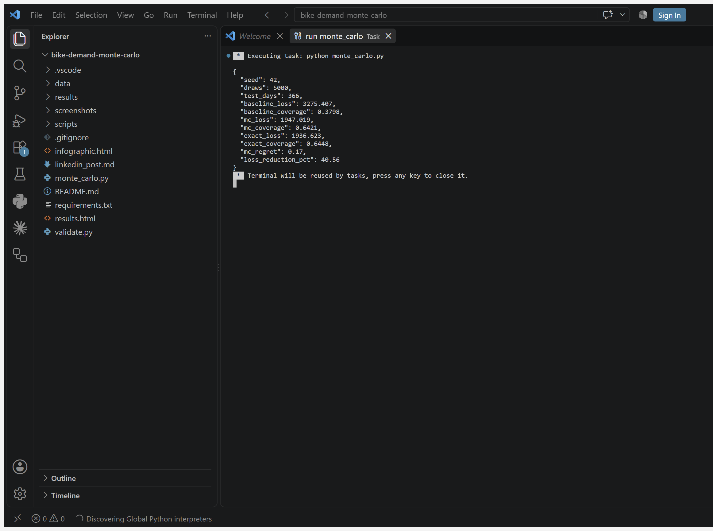

# Empirical distribution on a real bike shop: the quantile did the work, not the draws

**A 50-line Python implementation of the empirical distribution (Eq. 3.28) and Monte Carlo
expectation (Eq. 17.3) from Goodfellow, Bengio and Courville's *Deep Learning*, run on 731
days of real Capital Bikeshare rentals.** Planning tomorrow's rental capacity for an assumed
4:1 shortage-to-idle penalty cut the mean penalty by **40.56%** against a rolling-mean plan
over the 366 days of 2012. Three things the audit added before publishing:

- a one-line `np.quantile(history, 0.8)` matches the 5,000-draw Monte Carlo plan, so the gain
  comes from planning for the asymmetric loss, not from sampling;
- the whole-year figure hides a **negative fourth quarter** (-33.5%), when demand was falling;
- a 7-day window with the same rule scores 59.3%, so the window length matters more than the
  method. That is a post-hoc sensitivity, not a tuned result.

This is a retrospective experiment on public data, not a deployed system or a measured saving.

## Business question

A bike-rental operator plans daily processing capacity. Under-planning (turned-away rentals,
queues, rebalancing) is assumed to cost four times as much per rental as unused capacity.
How much capacity should be planned for tomorrow, given only the past?

Capacity here means **rental transactions per day**, not bicycles or staff. One bicycle
supports many rentals, so this dataset cannot size a fleet. The objective is
`4 * max(demand - capacity, 0) + max(capacity - demand, 0)`; the 4:1 weights are a declared
assumption, not Capital Bikeshare's costs. Candidate capacities run 0 to 10,000 in steps of 250.
The 90-day lookback, grid and weights were fixed before the test and not tuned on it.

## Book to implementation

Source: Goodfellow, I., Bengio, Y., & Courville, A. (2016). *Deep Learning*. MIT Press.
Local PDF page = printed page + 16.

| Printed page | What the book says | What the code does |
|---|---|---|
| 65, Eq. 3.27 | The Dirac delta puts all mass at one point | Not evaluated numerically; rental counts are discrete, so frequencies suffice (the book says so on p. 66) |
| 66, Eq. 3.28 | The empirical distribution puts mass 1/m on each of m observations | Each of the previous 90 days gets weight 1/90; repeated counts accumulate mass |
| 588, Eq. 17.3 (ch. 17, authors' website) | Estimate an expectation by averaging n samples drawn from the distribution | 5,000 draws with replacement from the 90 days; average the penalty of every candidate capacity; pick the minimum |

**These pages contain equations, not a Python listing.** `monte_carlo.py` is an original
implementation of those two equations, not copied book code. Chapter 17 is not in the local
PDF (which ends inside chapter 8); it is cited from
[deeplearningbook.org](https://www.deeplearningbook.org/contents/monte_carlo.html).

## Dataset

[UCI Bike Sharing](https://doi.org/10.24432/C5W894), Hadi Fanaee-T (2013), CC BY 4.0.
`data/day.csv` holds 731 consecutive daily rows for 2011 to 2012 from Capital Bikeshare,
Washington DC, unmodified. Download URL and SHA-256 are in `data/provenance.json`. Only the
`cnt` column enters a decision; `casual` and `registered` are used to check that `cnt` is their
sum. No weather or calendar feature is used.

## Evaluation

For every day of 2012, use **only the previous 90 days**, choose a capacity, then score it
against that day's actual rentals. A rolling one-step backtest in date order, 366 test days.
`validate.py` perturbs every count from two cutoffs by +10,000 and checks that no decision
before the cutoff changes.

### Same 90-day window, different decision rule

| Plan | Mean penalty / day (lower is better) | Days covered |
|---|---:|---:|
| Previous-90-day mean, on the grid (baseline) | 3,275.407 | 37.98% |
| Monte Carlo, 5,000 draws, seed 42 | 1,947.019 | 64.21% |
| Exact expectation over the same 90 days | 1,936.623 | 64.48% |
| `np.quantile(history, 0.8)`, one line, no grid | 1,945.538 | 65.03% |
| Mean + 1 standard deviation, on the grid | 1,840.407 | 73.0% |

For a 4:1 loss the optimum is the 80th percentile of the window, so the Monte Carlo and exact
plans are both approximations of a one-line quantile. **The 40.56% measures loss-aware versus
loss-unaware planning, not sampling.** Four Monte Carlo seeds (42, 7, 21, 84) give 40.56%,
40.35%, 40.94% and 40.70%: sampling noise is the least interesting spread here.

### The 40.56% by quarter

| Quarter 2012 | Mean demand | Mean plan | Monte Carlo plan | Reduction |
|---|---:|---:|---:|---:|
| Q1 | 4,008 | 4,067.5 | 2,400.2 | +41.0% |
| Q2 | 6,296 | 4,746.3 | 1,763.9 | +62.8% |
| Q3 | 6,920 | 2,404.6 | 1,079.8 | +55.1% |
| Q4 | 5,165 | 1,907.8 | 2,547.3 | **-33.5%** |

The Monte Carlo plan beats the mean plan on 208 of 366 days. When demand falls in Q4, an 80th
percentile of a window drawn from the summer over-provisions and loses to the mean. A weekly
block bootstrap over the test days (5,000 resamples) puts the annual reduction at
**29.8% to 49.5%**.

### Coverage, compared with what it should be compared with

The 4:1 loss implies planning at the 80th percentile. Inside its own 90-day window the plan
covers 80.9% of days. On the 2012 test days it covers 64.21%. That 16-point gap is
nonstationarity: 2012 demand ran above its trailing 90-day mean on 62.3% of days. The series
was rising, which is also why the mean plan lags so badly in Q1 to Q3.

### Window length (post-hoc sensitivity on the same test year, not tuned)

| Same 0.8-quantile rule | Mean penalty / day | Days covered | vs mean plan |
|---|---:|---:|---:|
| Previous 7 days | 1,332.836 | 71.0% | 59.3% |
| Previous 14 days | 1,385.281 | 73.5% | 57.7% |
| Previous 30 days | 1,417.996 | 75.4% | 56.7% |
| Previous 60 days | 1,675.137 | 68.9% | 48.9% |
| Previous 90 days (the project's choice) | 1,945.538 | 65.0% | 40.6% |
| Max of the previous 7 days | 1,343.172 | 85.8% | 59.0% |

These were run after the 90-day result was known, so they are reported as a sensitivity, not
promoted to the headline.

## Run and verify

Verified on Windows 11, Python 3.13.5, NumPy 2.2.6, pandas 2.3.1 (the VS Code screenshot).
Every number also reproduces bit-for-bit on Python 3.13.5 with NumPy 2.3.5 and pandas 3.0.1.

```bash
python -m pip install -r requirements.txt
python monte_carlo.py      # the 50-line core; prints metrics, writes results/backtest.csv
python validate.py         # 11 checks; writes results/validation.json
python baselines.py        # audit-driven baselines, quarters, bootstrap; writes results/baselines.json
```

`monte_carlo.py` is exactly **50 physical lines** including imports, blank lines and I/O;
`validate.py` asserts that count. The checks: 731 unique consecutive dates, `cnt` equals
`casual + registered`, loss arithmetic on a hand case, two runs identical, test days in date
order from 2012-01-01 to 2012-12-31, no future leakage at two cutoffs, four days' exact
decisions re-enumerated in plain Python, a constant-demand edge case, invalid inputs rejected,
three extra seeds. Logs of every run are in `results/`.



## Practical limits and next step

Observed rentals are constrained by bike availability; they are not unmet demand. Ninety
equally weighted days ignore season, weather, growth and serial dependence, and the Q4 result
shows the cost of that. Resampling cannot produce a value absent from its window. In
production, start with the one-line quantile, shorten the window, add calendar and weather
forecasts and an explicit service target, calibrate real shortage and idle costs with
operations, and evaluate on a fresh period. Nothing here establishes a real-world saving.

## Files

`monte_carlo.py` (50-line core), `validate.py`, `baselines.py`, `data/day.csv`,
`data/provenance.json`, `results/` (backtest, metrics, validation, baselines, run logs),
`screenshots/vscode_run.png`. Book pages and extracted book text are not redistributed.
